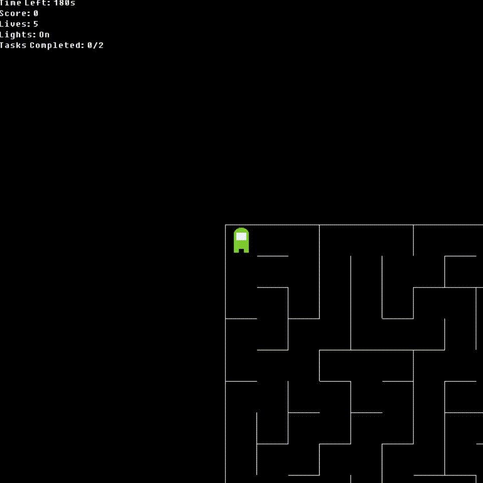

# Computer Graphics Assignment 2

## AMangoes: A cheezy rip off of Among Us.



##### Red Boi is Sussy Baka

### Build and Run

```
make
./amangoes
```
##### Build Requirements
1. OpenGL 3.3
2. GLAD
3. GLFW

### Gameplay

You are the Green Among Us character dropped into a maze. You need to complete the required tasks and find the exit before you die. Use your arrow keys to navigate around the maze.

##### Ways to Die
* The time runs out (You have 180 seconds).
* Your lives drop to 0 (You initially have 5 lives).
* You get caught by the Imposter (Red Among Us character).

#### Tasks
* Find and get to the Orange Tile in the maze to vaporize the Imposter before it kills you.
* Find and get to the Cyan Tile in the maze to release Gems and Bombs into the Maze.

The tasks can be completed in any order.

#### Exit
Once you have completed the above two tasks, an Exit randomly spawns somewhere in the maze. It is marked as a Blue Rhombus. Get to the exit with more than 0 lives and before the time runs out to win the game.

#### Collectables
1. Gems: Add 25 to your score when you collect them. (Look like yellow color gems)
2. Bombs: Reduce your health by 1 when you walk over them. (You may often be forced to do this because a Bomb may be blocking the only path available to you, so keep an eye on your lives and guage the risk to reward factor) (Look like Dynamite kept together with a Blue tape and a timer on it).

#### Lights
You can toggle the lights in the maze by pressing `L`. When lights are on, you can see the entire maze clearly. When lights are off, only a small region near you is illuminated and light doesn't penetrate through walls.

#### Scoring
Every two seconds you spend in the maze, your score goes up. If lights are on, your score increases by **1** every two seconds. If lights are off, your score increases by **5** every two seconds.

### Specifications

The maze is procedurally generated at run time using Depth First Search with an iterative backtracking approach (this generates a random maze at every run). However, this creates a perfect maze (any two cells in the maze have one and only one path connecting them). This is not ideal because if the Imposter is spawned in the path between you and the orange tile, there is no way you can win the game. Thus, after the DFS, each cell is chosen with a 5% probability and one of its walls is removed at random to introduce cycles into the maze.

In each frame, the Imposter calculates the shortest distance to every other cell in the maze using Breadth First Search and stores the distances in a map. Then it looks at the distance of the player's current cell and iteratively searches through its neighbours to find the neighbour with a distance one less than the player's cell. It repeats this process till the distance becomes 0 (i.e., the path has lead back to the imposter). At each step it pushes the current cell into a stack. Once the path has been identified, the top most cell on the stack will be the imposter's current position and the second cell will be the next cell the imposter should go to. Inductively, this leads to the shortest path between the imposter and the player, which is recalculated every frame.
